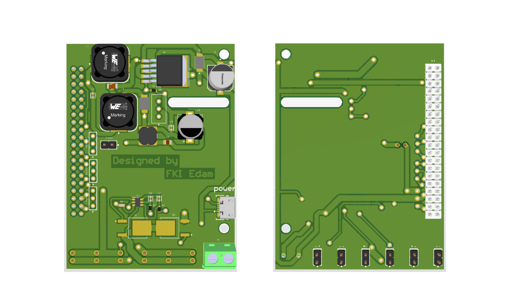

# Development of an Intelligent Camera System for the Detection & Automatic Centering of Markers

## 1- Brief Description

The motivation behind this project stems from the need to enhance the safety, efficiency,
and accuracy of power line inspections. Traditional methods, which often involve
manned helicopters, are not only costly and time-consuming but also pose significant
risks to human operators. By automating the detection and centering processes
using advanced algorithms, embedded systems, and wireless communication,
this project aims to offer a more reliable and scalable solution that can adapt to various
geographical and environmental conditions.

## 2- Requirements and coverage

- [x] The system must detect markers in images and their offset from the desired position (e.g., using an algorithm like Canny edge detection)
- [x] The system must include an embedded controller to correct the camera position across all three axes (e.g., using servo motors)
- [x] The system must support wireless communication of the original image and correction parameters (e.g., using Bluetooth Low Energy boards)
- [x] The system must implement energy management for all components (e.g., utilizing solar panels or rechargeable batteries)
- [x] The system must feature an Android app to display images and correction parameters.
- [x] The system must be printed onto a PCB card.
- [x] The camera support allowing the camera to turn around all three axes must be modeled and printed.

## 3- The Technological Stack

Currently, the project uses the following technologies:

- Raspberry Pi 4 (single-board computer)
- ESP32 (Wi-Fi and Bluetooth microcontroller)
- Power Management Unit (PMU)
- Pi Camera (camera module for Raspberry Pi)
- Batteries and Solar Panels (for power management)
- Altium Designer (for PCB design)
- Pi Imager (for creating Raspberry Pi SD cards)
- Arduino IDE (for microcontroller programming)
- VNC Viewer (for remote desktop control)
- Fusion 360 (for 3D design and manufacturing)
- Blender (for 3D graphics and modeling)
- Python (for computer vision algorithm development)
- VS Code (source code editor)
- OpenCV (computer vision library)
- Flutter (UI development kit)
- Dart (for mobile app development )

## 4- Solution Architecture

### 4.1- Hardware Architecture

#### Overview

##### Data Flow
  
- The data flow diagram represents the core process of the project. The process begins with the camera capturing a frame, which is processed by the Raspberry Pi 4 using a computer vision algorithm. This algorithm calculates deviations along three axes.
- These deviations are compared against a predefined epsilon value. If any deviation exceeds the epsilon threshold, the values are transmitted to the ESP32.
- The ESP32 stores the deviations and commands the servo motors to adjust the camera’s position to the desired alignment. 
- This cycle repeats until all deviations fall within the epsilon threshold.
- When the system meets this condition, it waits for the next cycle to begin.
- If a Bluetooth connection is established with a mobile device, the set of deviations is transmitted to the mobile application for logging and monitoring.

##### Current Flow
  
- The current flow diagram shows the power distribution in the project.
- Batteries provide power to the entire system, managed by the Power Management Unit (PMU).
- The PMU ensures stable voltage and current delivery to all components.
- It also manages the battery charging process using solar panels, while protecting against overcharging, overdischarging, and short circuits, ensuring safe and efficient operation of the system.

## 4.2- Software Architecture

### Computer Vision
- The approach overview is depicted in Figure 3.3, which outlines the steps taken to provide the necessary offsets to the system.
- The camera captures frames, which are processed by the computer vision algorithm on the Raspberry Pi to calculate deviations from the desired position across three axes.

    

## 3D Modeling

This section highlights the various components we modeled for our solution. Since the mechanical aspect of the project was not the main focus, we do not go into detail on the technical drawings.

- **Figure 4.2.1** – Full Gimbal: A complete view of the gimbal designed to hold the camera.
  
- **Figure 4.2.2** – Unmounted Full Gimbal: A view of the gimbal when disassembled.
  
- **Figure 4.2.3** – Battery Holder: A custom-designed holder for securing the batteries that power the system.
  

## 5- Embedded System

## Strategies for Power Efficiency

### Manual Sleep Mode Implementation
The Raspberry Pi 4 does not have a built-in sleep mode, so a manual solution was implemented. This involves powering on the Raspberry Pi, performing calculations and camera alignment, scheduling the next boot, and then shutting down the system. This approach allows a 2.4 Ah battery to support approximately 13 hours of operation, effectively doubling the battery life.

### Integrating ESP8266 to Manage Raspberry Pi Power Usage
To further optimize power consumption, the ESP8266 was integrated as a secondary microcontroller. It consumes roughly one-tenth of the power used by the Raspberry Pi in power-off mode, allowing the ESP8266 to control the power to the Raspberry Pi and extending battery life to approximately 60 hours with the same battery.

## Raspberry Pi Issues and Implemented Solutions

### Instability in PWM Signal
The PWM signal generated by the Raspberry Pi was unstable, causing jitter in the servos. The ESP8266 was used to drive the servos, providing a more stable PWM signal.

### Transition to ESP32 for Bluetooth Communication
Bluetooth communication was challenging with the Raspberry Pi, so the ESP32 was chosen for its integrated Bluetooth capabilities and lower power consumption, enabling efficient data exchange with the mobile app.

## Design of Power Management Unit

### Schematic

The schematic includes:
- **DC-DC Converter**: Stabilizes charging voltage at 8.4V and supplies a consistent 5V to the Raspberry Pi and other components.
- **Battery Management System (BMS)**: Controls charging and discharging, prevents overcharging and overdischarging, and ensures voltage balancing.

### PCB
  
  

## Energy Consumption

### System Cycle

| Component         | Energy Consumption        | Duration      |
|-------------------|---------------------------|---------------|
| Raspberry Pi 4    | At Shut Down: 250mA      | 60s           |
|                   | At Processing: 600mA     |               |
|                   | At Booting: 1A           |               |
| ESP32             | At Idle: 20mA            | 15 min        |
|                   | At Processing: 80mA      |               |
| PMU               | 20mA                      | 15 min        |
| Servo Motor       | 0.1A                      | 4s            |
| Camera            | 0.1A                      | 4s            |

### Battery Life
Average power consumption calculated to be approximately 0.7W, resulting in an autonomy of 25h 22min with the existing battery setup. A more powerful solar panel will be needed for full recharging.

### Solar Panel
Initially used a 50W, 17V solar panel, but switched to smaller solar cells for size efficiency while maintaining sufficient power for battery recharging.

## Communication Between ESP-32 and Raspberry Pi 4

### Explored Protocols
- **SPI**: High data rate, master/slave configuration.
- **UART**: Simple, peer-to-peer communication.
- **I2C**: Multi-master/slave with two lines.
- **MQTT**: Lightweight, suitable for IoT applications.

### Selected Protocol: Serial (UART)
After evaluation, UART was chosen for its simplicity and sufficient data rate, allowing either device to initiate communication.

### Implementation Details
#### Hardware Setup
- **UART Communication Lines**: 
  - Pi TX Pin → ESP32 UART1 RX Pin
  - Pi RX Pin → ESP32 UART1 TX Pin
- **Interrupt Line**: 
  - Pi GPIO Pin → ESP32 GPIO Pin
- **Ground Connection**: 
  - GND pins connected for a common ground reference.

#### Protocol Workflow

    

The communication involves initialization, data transmission triggers, and acknowledgment of received data between the Raspberry Pi and ESP32.

## 6- Computer Vision

## Cross Detection

### Approach Overview

### Contour Detection

In this step, the image is loaded in grayscale to simplify data and enhance edge detection. A Gaussian blur filter is applied to reduce noise, followed by Canny edge detection with optimal threshold values to filter weak edges while retaining strong ones. Finally, contours are extracted from the edge-detected image.

To address discontinuities in the contours, dilation is applied to the edge-detected image, expanding the boundaries of detected edges.

### Decision About the Cross

The detected contours are simplified and approximated to polygons with fewer vertices using a specified epsilon parameter for accuracy. Contours with 12 corners are filtered to identify the cross shape, and a bounding box is determined to convert offsets from pixels to meters.

### Offsets Computation

Offsets for the servo motors are calculated by determining the centers of the image and the cross. The difference in pixel coordinates on the x and y axes is computed. Using the cross width, a ratio for converting pixel measurements to physical dimensions is derived, allowing the extraction of angles for servo-motor adjustments.

Additionally, the alignment of the cross is considered by calculating its deviation from the horizontal axis by drawing a line between the closest detected corners and calculating the angle relative to the axis.

### Approach Limits
The algorithm can theoretically detect a cross with an opacity level of 6%, but in practice, it achieves around 25%.

## Mathematical Approach

### Overview
Let (X, Y, Z) be the orthonormal reference attached to the camera, where Z is vertical and X points at the detected object. The orientations the camera must adjust to center the detected object are represented as θX, θY, and θZ.

The algorithm follows these steps:
1. The distance D between the camera and the detected object (cross or pole) is input.
2. The width of the item in pixels is computed to approximate the pixel-to-meter ratio.
3. Offsets along the vertical and horizontal axes are calculated, yielding rotations θZ and θY around the Z and Y axes.
4. Rotation along the θX axis is determined by comparing the object's orientation relative to the horizontal axis.

### Validity of the Approximation
To reduce computational load, the approximation tan(θ) ≈ θ is used when θ approaches 0. Analysis shows that the error is under 0.01 for θ < 0.31 and under 0.1 for θ < 0.63, ensuring that deviations remain manageable for the project's conditions.

## Bluetooth Communication for Mobile Application

### Bluetooth Overview
Bluetooth is a wireless communication protocol designed for short-range data exchange between devices. Operating in the 2.4 GHz ISM band, it supports both point-to-point and point-to-multipoint connections. Bluetooth is widely used in consumer electronics for applications such as wireless audio, file transfers, and peripheral connections.

### Use Case and Implementation
In this system, Bluetooth facilitates communication between the ESP-32 and a mobile application, allowing users to interact via smartphones. Key features include remote control, status monitoring, and notifications.

The ESP-32 is configured to operate in Bluetooth Low Energy (BLE) mode, chosen for its low power consumption, essential for maintaining battery life in mobile applications. The mobile application connects to the ESP-32, enabling command transmission and real-time updates.

This wireless communication layer significantly enhances user experience, providing a convenient and accessible interface for system interaction without physical connections.

### Mobile Application
The mobile application is developed using Flutter and Dart, offering a cross-platform solution for both Android and iOS. Flutter enables the creation of visually appealing, high-performance interfaces, while Dart provides flexibility for handling Bluetooth communication and real-time data processing. This combination ensures a responsive and seamless user experience.

For Bluetooth communication, the SerialBT library is implemented on the ESP-32, providing a reliable method for data transmission between the system and the mobile app. SerialBT supports Bluetooth Classic profiles, ensuring compatibility and stability. This setup allows the ESP-32 to transmit real-time data, including cycle details and measurement offsets, directly to the app.

Once a stable Bluetooth connection is established, the system enters a critical phase where real-time data from the current cycle is transmitted. The ESP-32 provides detailed cycle information, including offsets, measurement indices, and current positions.

The mobile app processes incoming data to compute and display precise timestamps for each measurement, calculating the difference between the current time and the start of the cycle. This allows for accurate iteration through remaining measurements and the creation of a timeline.

In addition to real-time data presentation, the app generates a histogram visualizing the distribution of measurements over time. This provides users with accurate, time-stamped information and insights into the temporal distribution of measurements within each cycle.

The user interface prioritizes clarity and usability, focusing on presenting essential data in an intuitive format.

### Screenshots of the Application

    
    
    
    

